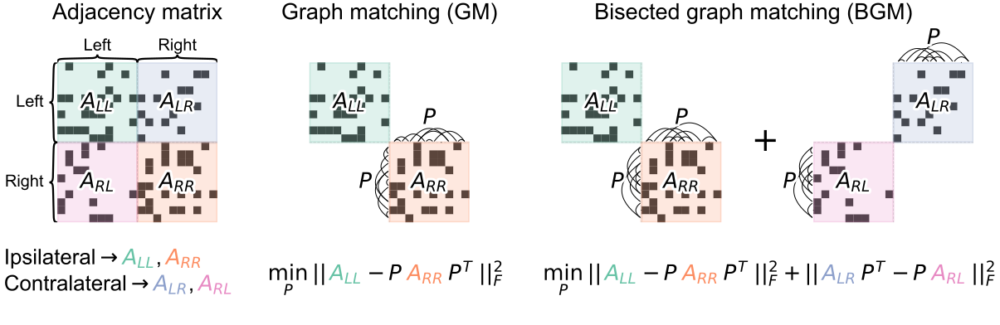

# Bisected graph matching improves automated neuron pairing between hemispheres in connectomes

[](http://docs.neurodata.io/bgm/) [](https://zenodo.org/badge/latestdoi/475470258)

## Abstract 
Graph matching algorithms attempt to find the best correspondence between the nodes of two networks. These techniques have previously been used to match individual neurons in nanoscale connectomes; in particular, to find pairings of neurons across hemispheres. However, since graph matching techniques deal specifically with two networks, they have only utilized the ipsilateral (same hemisphere) subgraphs when performing the matching. Here, we present a modification to a state-of-the-art graph matching algorithm which allows it to solve what we call the bisected graph matching problem. This modification allows us to use connections between the brain hemispheres when predicting neuron pairs. We show in simulation as well as real connectome examples that when edge correlation is present between the contralateral (between hemisphere) subgraphs, this approach improves matching accuracy. We expect that our proposed method will improve future endeavors to accurately match neurons between hemispheres in connectomes, and be useful in other applications where the bisected graph matching problem arises.


 
## Repo structure 
- ``.github``: Files specifying how the repo behaves on GitHub.
- ``data``: Directory to store the raw data. 
- ``docs``: Files to build the documentation website (in the form of a [Jupyter Book](https://jupyterbook.org/intro.html)), talks, and posters.
- ``overleaf``: Link to an Overleaf document as a git submodule.
- ``pkg``: A local Python package used for analysis in the Jupyter Notebooks/Python scripts.
- ``results``: Place to store intermediate outputs, figures, and saved variables. 
- ``sandbox``: Junk scripts not part of the final paper/project.
- ``scripts``: Python scripts used to do all analyses
- ``shell``: Shell scripts used to run the entire project, copy results, etc.

## Guide to using the repository
### Getting the code and setting up an environment
Prerequisites: `git`, working knowledge of Python and command line tools.

#### Using Poetry
I recommend using [Poetry](https://python-poetry.org/) to create and manage a 
reproducible environment for running the code for this project. 
- If you don't have it already, [install Poetry](https://python-poetry.org/docs/#installation) following their linked instructions.
- Navigate to a directory where you want to store the project, and clone this repo: 
   ```
   git clone https://github.com/neurodata/bgm
   ```
- (TEMPORARY) Clone the sister repository, `giskard`:
  ```
  git clone https://github.com/bdpedigo/giskard.git
  ```
  - Note: once the code is stable, this will be replaced by an install from PyPI
- Enter the newly cloned directory:
  ```
  cd bgm
  ```
- Create a Poetry environment:
  - Note: this requires that you have a Python 3.9 installation on your machine. It is
    possible that the code for this project will run with other versions of Python,
    but I haven't tested it. To check if you have Python 3.9, you can do: 
    ```
    which python3.9
    ```
    If the result says `python3.9 not found` then you'll need to get a 3.9 interpreter
    on your machine. Common ways to install an interpreter are via
    [python.org](https://www.python.org/downloads/), [brew](https://docs.brew.sh/Homebrew-and-Python), or 
    [conda](https://anaconda.org/anaconda/python).
  - After you have ensured you have a Python 3.9 installation, do:
    ```
    poetry env use python3.9
    ```
  - For me, the output looks like
     ```
    Creating virtualenv bgm in /Users/bpedigo/bgm/bgm/.venv
    Using virtualenv: /Users/bpedigo/bgm/bgm/.venv
    ```
  
- To activate the new environment, do 
  ```
  source .venv/bin/activate
  ```
  - If you need to deactivate this environment, just type `deactivate`

#### Using `pip`
*Coming soon*

### Data 
The raw data is copied from the papers cited (see Table 1 in the paper) and included
in this repository. There are also scripts to process the raw data into a format that
is amenable for matching, see `scripts/process_c_elegans.py`, 
`scripts/process_maggot.py`, and `scripts/process_p_pacificus.py`. The processed data
is stored in `data/processed_split`.

### Running the code
- Make sure your virtual environment from the last section is active.
- Now you should be able to run any individual python files like normal, for example: 
  ```
  python ./bgm/scripts/explain.py
  ```
- Instead of running as a Python file, you can also easily convert a Python file to a
  notebook, execute it, and have it included in the documentation folder for rendering
  as a Jupyter Book. To do so, use the `make_notebook.sh` script and pass in the name of 
  the python file (without the `.py` file extension):
  ```
  sh ./bgm/shell/make_notebook explain
  ```
  If you'd like to build that individual notebook and then rebuild the documentation,
  just add the `-b` argument to the same script:
  ```
  sh ./bilateral-connectome/shell/make_notebook -b explain
  ```
- You can also build and run all notebooks which are essential to the final paper via
  the `make_project.sh` script: 
  ```
  sh ./bgm/shell/make_project.sh
  ```

### Building the documentation Jupyter Book
The notebooks associated with this project are assembled into a
[Jupyter Book](https://jupyterbook.org/). 
- To build the documentation, do:
  ```
  jb build ./bgm/docs
  ```
- You can then view the locally built HTML by pasting the produced link into your
  browser. For me, the built index is stored at `./bgm/docs/_build/html/index.html`


## Questions about the code or paper 
Please get in touch! You are welcome to [make an issue](https://github.com/neurodata/bgm/issues/new)
or email me at [bpedigo@jhu.edu](mailto:bpedigo@jhu.edu).
