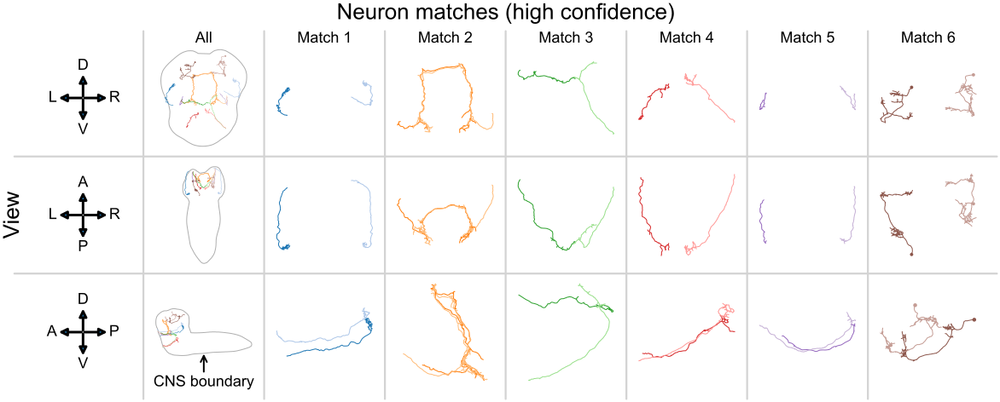

<!-- footer: __Paper:__ tinyurl.com/neuromatch-bgm -->

<!-- _paginate: false -->

 
 
 

# Bisected graph matching

 

## Benjamin D. Pedigo - Johns Hopkins University

---

# Graph matching (GM) for connectomics

Example bilateral neuron pair *Eschbach et al. 2021*

---

# Bisected graph matching (BGM)

**We adapt the FAQ algorithm (Vogelstein et al. 2015) to solve BGM**

---

# BGM increases matching accuracy

---

<!--  -->

# Extensions to BGM: multiplex networks

<!-- 

 -->

<!-- ## Seeded matching (*Dros.* larva)

 -->

---

<!--  -->

# Summary

- Matching approaches can help find paired neurons between connectomes
- BGM uses more of the data to improve matching between hemispheres
- Manuscript on bioRxiv: tinyurl.com/neuromatch-bgm
- Code for all experiments: github.com/neurodata/bgm
- Matching algorithm: github.com/microsoft/graspologic
- Contact: bpedigo@jhu.edu

## Acknowledgements
- Co-authors: Michael Winding, Carey E. Priebe, Joshua T. Vogelstein 
- Funding: NSF GRFP, NSF Career, NIH BRAIN Initiative, Microsoft Research