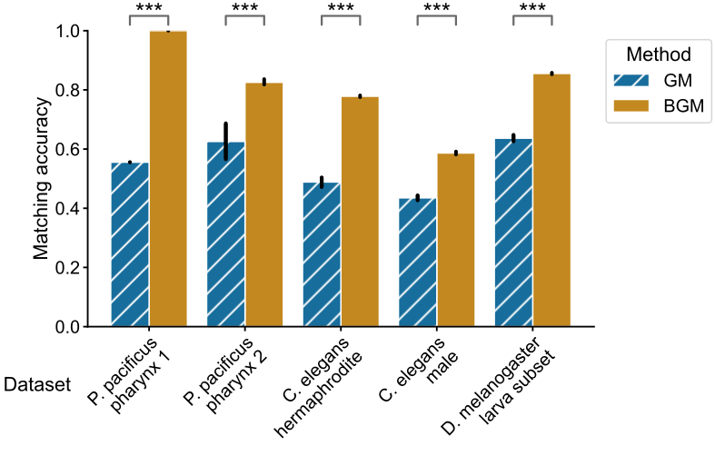

<!-- Hello, my name is Ben Pedigo, and I’m excited to tell you about my work on bisected graph matching and how it can be useful in connectomics.  -->

<!-- footer: __Paper:__ tinyurl.com/neuromatch-bgm -->

<!-- _paginate: false -->

 
 
 

# Bisected graph matching

 

## Benjamin D. Pedigo - Johns Hopkins University

---

<!-- So, why are we talking about graph matching in the first place, and what is it?

The motivation for this work is what you see on the left, which shows a bilaterally homologous neuron pair in the Drosophila larva. In Drosophila, C. elegans, and many other small organisms which are studied in connectomics, neurons often have a bilaterally homologous pair on the other side of the nervous system. These neurons are thought to be similar in terms of morphology, gene expression, and most importantly for this work, connectivity. 

Mapping the connectome of one of these organisms gives us a network of neurons, represented here as an adjacency matrix. I've sorted this adjacency matrix for an imaginary connectome by what side of the brain each neuron is in. Given one of these networks, several recent works showed that we can use graph matching to predict these neuron pairings from the basis of connectivity. Graph matching tries to make the adjacency matrix of the left-to-left hemisphere connections as similar as possible to that of the right-to-right hemisphere connections. It does so by optimizing over the set of matchings of these two subnetworks, here represented by P, which is a permutation of the nodes of one hemisphere with respect to the other.
 -->

# Graph matching (GM) for connectomics

Example bilateral neuron pair *Eschbach et al. 2021*

---

<!-- Now, notice that this approach of using graph matching ignores the connectivity which goes between the hemispheres, for instance this subgraph of connections from the left hemisphere to the right hemisphere. 

In this work, we asked a very simple question - would including these connections in our optimization improve matching performance? To get at this question, we created what we call the bisected graph matching problem. We added a term to the graph matching objective function which tries to make the contralateral subgraphs look as similar as possible under some matching. Further, we adapted a state-of-the-art graph matching algorithm called FAQ to solve this modified problem. 
-->

# Bisected graph matching (BGM)

**We adapt the FAQ algorithm (Vogelstein et al. 2015) to solve BGM**

---

<!-- To test our approach, we evaluated graph matching and bisected graph matching on 5 published connectome datasets for which these bilateral pairings were already known. We found that on all 5 of the connectome datasets we examined, this bisected graph matching procedure significantly improved matching accuracy, and buy a surprisingly large amount.  -->

# BGM increases matching accuracy

---

<!-- BGM can also be combined with other extensions of graph matching. Here, we combine our approach with multiplex graph matching. Multiplex graph matching allows us to incorporate multiple types of connections in the optimization - here, both chemical and electrical synapses in the C. elegans. We found that using bisected and multiplex graph matching improved matching accuracy more than using either technique alone on two c. elegans connectomes. Our paper describes how to combine BGM with several other graph matching extensions which can further improve performance.  -->

# Extensions to BGM: multiplex networks

---

<!-- To summarize, graph matching is a useful way of pairing neurons between connectome datasets; in particular, between the two sides of a nervous system. 

When doing this matching between hemispheres, we present a method for including the entire connectome in the optimization, which we find greatly improves performance in practice. 

There’s a link to the manuscript on bioarxiv, as well all code for this manuscript. We also include an implementation of graph matching and bisected graph matching in our open source python package, graspologic. Please feel free to get in touch if you have any questions.
 -->

# Summary

- Matching approaches can help find paired neurons between connectomes
- BGM uses more of the data to improve matching between hemispheres
- Manuscript on bioRxiv: tinyurl.com/neuromatch-bgm
- Code for all experiments: github.com/neurodata/bgm
- Matching algorithm: github.com/microsoft/graspologic
- Contact: bpedigo@jhu.edu

## Acknowledgements
- Co-authors: Michael Winding, Carey E. Priebe, Joshua T. Vogelstein 
- Funding: NSF GRFP, NSF Career, NIH BRAIN Initiative, Microsoft Research