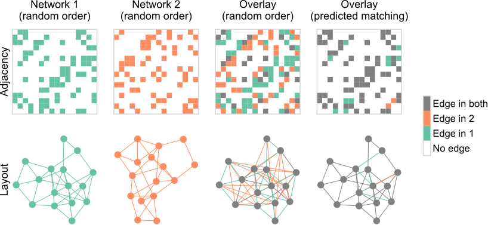

<!-- _paginate: false -->


<!-- # Generative network modeling reveals a first quantitative definition of bilateral symmetry exhibited by a whole insect brain connectome -->
<!--  [_@bpedigod (Twitter)_](https://twitter.com/bpedigod) -->


<!-- # Generative network modeling reveals a quantitative definition of bilateral symmetry exhibited by a whole insect brain connectome -->
# Graph matching for connectomics

<br>

<div class="columns">
<div>

## Benjamin D. Pedigo
(he/him)
[NeuroData lab](https://neurodata.io/)
Johns Hopkins University
Dept. of Biomedical Engineering


 [bpedigo@jhu.edu](mailto:bpedigo@jhu.edu)
 [@bdpedigo (Github)](https://github.com/bdpedigo)
 [@bpedigod (Twitter)](https://twitter.com/bpedigod)
 [bdpedigo.github.io](https://bdpedigo.github.io/)

</div>
<div>

### These slides at: 
<!-- ### [tinyurl.com/princeton-bilarva](https://tinyurl.com/princeton-bilarva) -->


</div>
</div>

---

<!-- Timing: 23:00  -->

# Bilaterally homologous neuron pairs 

We believe a matching exists!


<!-- _footer: Eschbach et al. eLife (2021) -->

---
# Why care about the pairs? 
- Proofreading
- Understand stereotypy
- Downstream analysis 
   - Network embedding, for example
- Useful to collapse complexity by ~2 
- Align one connectome to another, in some sense

---

<style scoped>
section {
    justify-content: center;
    text-align: center;
}
</style>

# How can we use the network structure to predict an {alignment, matching, pairing} of nodes from one network to another?

---

# When the node "labels" aren't helpful

<div class="columns">
<div>


</div>
<div>

- Week 1: observe a network ($A$) of phone #s and the calls they make to each other
- Week 2: all of the #s change! But a (noisy) version of that network still exists, with different labels... ($B$)
- How to map nodes of network $A$ to those of network $B$?

</div>
</div>


<!-- _footer: The Wire Season 3 Episode 7, HBO -->

---
# How do we represent a network? 

<div class="columns">
<div>

###


</div>
<div>

### Adjacency matrix


</div>
</div>

--- 
# Any permutation of an adjacency matrix is equally valid

## Permutation matrices ($P$) on 3 nodes


## Permuting an adjacency matrix
$PA$ permutes the rows of $A$
$AP^T$ permutes the columns of $A$
So for an adjacency matrix, we always want $PAP^T$!

---
# A permutation of one network with respect to another is an {alignment, matching, pairing}


--- 
# What is graph matching?



---
# Framing the graph matching problem mathematically

<style scoped>
h2,h5 {
    justify-content: center;
    text-align: center;
}
</style>

## $\min_{P \in \mathcal{P}} \underbrace{\|A - \overbrace{PBP^T}^{\text{reordered } B}\|_F^2}_{\text{distance between adj. mats.}}$

##### where $\mathcal{P}$ is the set of permutation matrices

<br>

- Measures the number of edge disagreements for unweighted networks,
- Norm of edge disagreements for weighted networks

<!-- ---

# Neuron pairs 

<div class="columns2-bl">
<div>


</div>
<div>


</div>
</div> -->


---

# Graph matching - how do we do it?

<style scoped>
h2 {
    justify-content: center;
    text-align: center;
}
</style>

## $\min_{P \in \mathcal{P}} \|A - P B P^T\|_F^2$
- Search space is not convex:
    - $0.5 P_1 + 0.5 P_2 \notin \mathcal{P}$
- Relax to the "birkoff polytope:" doubly stochastic matrices
    - Rows and columns all sum to 1, but not all elements have to be 1 
    - Similar to *transport* as opposed to *assignment* problems: we are still mapping nodes between networks, but this is a *soft* mapping
- Apply Frank-Wolfe method
    - Minimize a first-order Taylor series of the objective function over a convex set
    - Requires a gradient $\nabla f(P)$

<!-- _footer: Vogelstein et al. 2015 - Fast approximate quadratic (FAQ) algorithm -->

---
# Let's try it out... 

##### `graspologic`
```
from graspologic.match import GraphMatch

gm = GraphMatch() # parameters go in here
gm.fit(A, B) # adjacency matrices go in here
perm = gm.perm_inds_ # indices representing the permutation
B_permuted = B[perm][:, perm]
```

##### `SciPy`
```
from scipy.optimize import quadratic_assignment

quadratic_assignment(A,B,method='faq',options=dict(maximize=True))
```

---
<!-- Timing: ~6 min -->

# Larval _Drosophila_ brain connectome 


<div class="columns">
<div>

<style scoped>
p {
  justify-content: center;
  text-align: center;
  padding-top: 0px;
  margin-top: 0px;
}
</style>


~3k neurons, ~550K synapses
**Both hemispheres**

</div>
<div>


</div>
</div>

<!-- _footer: Winding, Pedigo et al. Submitted (2022) -->


---
# Matching (by connectivity only) performs fairly well


<style scoped>
p {
    justify-content: center;
    text-align: center;
}
</style>

With "vanilla" graph matching: ~80% correct (according to expert annotator)

---
# Many ways to try to improve on this...

<div class="columns">
<div>

- Partial knowledge of the matching (seeds)
- Neuron similarity information, (e.g. NBLAST/morphology)
- Edge types allow for "multilayer" graph matching

</div>
<div>


*Summary of "edge types" based on neuron compartments*

</div>
</div>

<!-- _footer: Fishkind et al. Pattern Recognition (2019), Pantazis et al. Applied Network Science (2022), Winding, Pedigo et al. Submitted (2022) -->


---
# Seeds (partial known pairing of nodes)

## $\min_{P \in \mathcal{P_{s}}} \|A - P B P^T\|_F^2$
##### where $\mathcal{P_{s}}$ is the set of permutations which respect your known, partial pairing

##### `graspologic`
```
from graspologic.match import GraphMatch

gm = GraphMatch()
gm.fit(A, B, seeds_A=[1,2,3], seeds_B=[4,5,1])
```

<!-- _footer: Fishkind et al. Pattern Recognition (2019) -->

---
# Similarity information (e.g. morphology)

If $S$ is a matrix representing the similarity of each object in $A$ (rows) to each object in $B$ (columns)...

## $\min_{P \in \mathcal{P}} \|A - P B P^T\|_F^2 + trace(SP^T)$


##### `graspologic`
```
from graspologic.match import GraphMatch

gm = GraphMatch()
gm.fit(A, B, S=S)
```

---
# Edge types (multilayer graph matching)

## $\min_{P \in \mathcal{P}} \|A^{(1)} - P B^{(1)} P^T\|_F^2 + \|A^{(2)} - P B^{(2)} P^T\|_F^2 + ...$

<br>

##### `graspologic` (in development)
```
from graspologic.match import graph_match

graph_match([A1, A2], [B1, B2])
```

<!-- _footer: Pantazis et al. Applied Network Science (2022) -->


--- 

<style scoped>
h1, h2 {
    padding-top: 140px;
    justify-content: center;
    text-align: center;
}
</style>

# Thus far, we've not used the contralateral connections

## These are about 1/3 of the edges in the brain!

---
# From graph matching to bisected graph matching


<!-- --LL: #66c2a5;
    --RR: #fc8d62;
    --source: #8da0cb;
    --target: #e78ac3;
    --LR: #8da0cb;
    --RL: #e78ac3; -->

New gradient: 

$$\nabla f(P) = - \textcolor{#66c2a5}{A_{LL}} P \textcolor{#fc8d62}{A_{RR}}^T + \textcolor{#66c2a5}{A_{LL}}^TP\textcolor{#fc8d62}{A_{RR}} + \textcolor{#8da0cb}{A_{LR}} P^T \textcolor{#e78ac3}{A_{RL}}^T + \textcolor{#e78ac3}{A_{RL}}^T P^T \textcolor{#8da0cb}{A_{LR}}$$

---
# Simulations

<div class="columns">
<div>

- Created simulated networks with two "sides"
   - Ipsilateral subgraphs had edge correlation of 0.8
   - Contralateral subgraphs had varying correlation (x-axis at right)
- Measured matching accuracy for graph matching (GM) and bisected graph matching (BGM)

</div>
<div>


</div>
</div>

--- 
# Connectome datasets


<!-- ---
# Summary 


- Modified the graph matching problem to allow us to incorporate information from contralateral connections in the brain
- Proposed an algorithm to solve the problem, which amounts to a simple modification of previous graph matching tools (FAQ)
- Showed in simulation that with sufficient correlation in contralateral edges, this 
  can help with matching
- Demonstrated that this indeed improves matching in five different bilateral connectome
  datasets  -->

---

# Graph matching for modern connectomics (putting it all together)

$\min_{P \in \mathcal{P}_s} \left [ \sum_{i=1}^K \|A_{LL}^{(i)} - P A_{RR}^{(i)} P^T\|_F^2 + \sum_{i=1}^K \|A_{LR}^{(i)} P^T - P A_{RL}^{(i)} \|_F^2 + tr(S P^T) \right ]$

where:
- $\mathcal{P}_s$ is the set of permutation matrices *which respect fixed seeds, $s$,* where the seeds give a known correspondence between some of the neurons.
- $A_{LL}$ and $A_{RR}$ are the within-hemisphere (ipsilateral) subgraphs.
- $A_{LR}$ and $A_{RL}$ are the between-hemisphere (contralateral) subgraphs.
- $S$ is a matrix of similarity scores between neurons, e.g. morphology (NBLAST).
- $K$ is the number of *layers* or edge types e.g. axo-axonic, axo-dendritic, etc.

---

# Putting it all together in the (new) code

##### `graspologic` (in development)
```
from graspologic.match import graph_match 

indices_A, indices_B, score, misc = graph_match(A_ll, # left-to-left
                                                A_rr, # right-to-right
                                                AB=A_lr, # left-to-right
                                                BA=A_rl, # right-to-left
                                                S=S, # similarity (e.g. morphology)
                                                partial_match=seeds # known alignemnt)
```

`indices_A` is a selection of the nodes of `A`
`indices_B` is a (at least partial) permutation of `B`
`score` is the final graph matching objective function
`misc` is a dictionary with extra details about the optimization path

---

# Practical considerations

- Networks not of the same size (see `padding`)
- Stopping tolerance for the algorithm
  - `max_iter` controls the maximum number of iterations (default is 30). If results are poor and computation is not taking too long, can try increasing 
  - `tol` is a stopping tolerance, same considerations as the above
- Initialization
  - Controlled by `init` parameter
  - Default is the "barycenter": can think of as an uninformative initialization
- Number of restarts
  - Algorithm is typically not deterministic, even from the same initialization
  - `n_init` parameter controls number of restarts

---
# R code

---
# More info 


<div class="columns">
<div>

- Tutorial on graph matching [https://bdpedigo.github.io/networks-course/graph_matching.html](https://bdpedigo.github.io/networks-course/graph_matching.html)
- Code in graspologic [https://microsoft.github.io/graspologic/latest/reference/reference/match.html](https://microsoft.github.io/graspologic/latest/reference/reference/match.html)
- Code in SciPy [https://docs.scipy.org/doc/scipy/reference/generated/scipy.optimize.quadratic_assignment.html](https://docs.scipy.org/doc/scipy/reference/generated/scipy.optimize.quadratic_assignment.html)
  
Big thanks to Ali Saad-Eldin for writing most of the code!

</div>
<div>

- This repo: [https://github.com/neurodata/bgm](https://github.com/neurodata/bgm)
- This Jupyter Book: [http://docs.neurodata.io/bgm/abstract.html](http://docs.neurodata.io/bgm/abstract.html)
- This manuscript: [https://www.biorxiv.org/content/10.1101/2022.05.19.492713](https://www.biorxiv.org/content/10.1101/2022.05.19.492713)

</div>
</div>

<!-- _footer:  -->