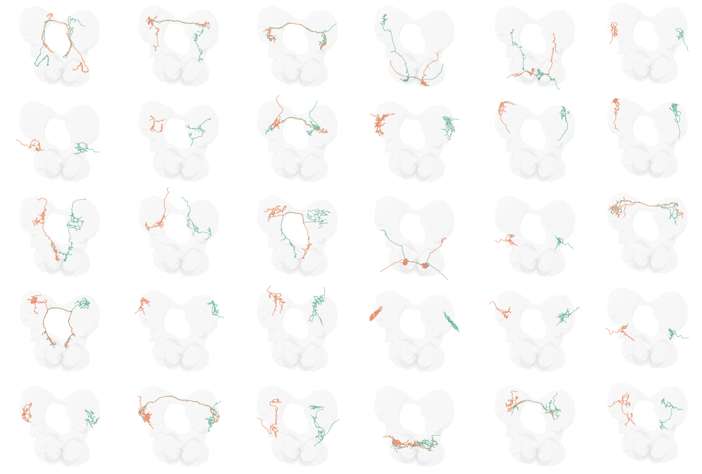

<!-- _paginate: false -->

<!-- # Generative network modeling reveals a first quantitative definition of bilateral symmetry exhibited by a whole insect brain connectome -->
<!--  [_@bpedigod (Twitter)_](https://twitter.com/bpedigod) -->

<!-- # Generative network modeling reveals a quantitative definition of bilateral symmetry exhibited by a whole insect brain connectome -->
# Graph matching for connectomics

 

## Benjamin D. Pedigo
(he/him)
[NeuroData lab](https://neurodata.io/)
Johns Hopkins University
Dept. of Biomedical Engineering

 [bpedigo@jhu.edu](mailto:bpedigo@jhu.edu)
 [@bdpedigo (Github)](https://github.com/bdpedigo)
 [@bpedigod (Twitter)](https://twitter.com/bpedigod)
 [bdpedigo.github.io](https://bdpedigo.github.io/)

### These slides at: 
<!-- ### [tinyurl.com/princeton-bilarva](https://tinyurl.com/princeton-bilarva) -->

---

<!-- Timing: 23:00  -->

# Bilaterally homologous neuron pairs 

We believe a matching exists!

<!-- _footer: Eschbach et al. eLife (2021) -->

---

# Larval _Drosophila_ (AKA a maggot) brain connectome

<!-- See [Michael Windings's talk](https://conference.neuromatch.io/abstract?edition=2021-4&submission_id=recVeh4RZFFRAQnIo) -->
- Collaboration with Marta Zlatic/Albert Cardona's groups - led by Michael Winding
- First whole-brain, single-cell connectome of any insect
- ~3000 neurons, ~550K synapses
- Both hemispheres of the brain reconstructed

<footer>
Winding, Pedigo et al. “The complete connectome of an insect brain.” In prep. (2022)
</footer>

---

# Neuron pairs 

---
# Why care about the pairs? 
- Understand stereotypy
- Proofreading
- Downstream analysis 
   - Omnibus embedding, for example
- Useful to collapse complexity by ~2 

---

# Can we use networks to predict this matching?

<!-- _footer: The Wire, Season 3, Episode 7 -->

--- 
# Graph matching - what is it?

---
# Graph matching - how do we know if we're doing good?

## $\min_{P \in \mathcal{P}} \|A - P B P^T\|_F^2$

- $\mathcal{P}$ is the set of permutation matrices
- Measures the number of edge disagreements for unweighted 
- Norm of edge disagreements for weighted

---

# Graph matching - how do we do it?

## $\min_{P \in \mathcal{P}} \|A - P B P^T\|_F^2$
- Search space is not convex:
    - $0.5 P_1 + 0.5 P_2 \notin \mathcal{P}$
- Relax to the "birkoff polytope:" doubly stochastic matrices
    - Rows and columns all sum to 1, but not all elements have to be 1 
    - Similar to *transport* as opposed to *assignment* problems: we are still mapping nodes between networks, but this is a *soft* mapping
- Apply Frank-Wolfe method
    - Minimize a first-order Taylor series of the objective function over a convex set
    - Requires a gradient $\nabla f(P)$

<!-- _footer: Vogelstein et al. 2015 - Fast approximate quadratic (FAQ) algorithm -->

---
# How does it do on the maggot brain? 

- ~76-80% correct on the full brain connectome for left-right pair prediction
- Lots of bells and whistles one can add:
    - Edge types
    - Seeds
    - Morphology

--- 

# Thus far, we've not used the contralateral connections

## These are about 1/3 of the edges in the brain!

---
# From graph matching to bisected graph matching

<!-- --LL: #66c2a5;
    --RR: #fc8d62;
    --source: #8da0cb;
    --target: #e78ac3;
    --LR: #8da0cb;
    --RL: #e78ac3; -->

New gradient: 

$$\nabla f(P) = - \textcolor{#66c2a5}{A_{LL}} P \textcolor{#fc8d62}{A_{RR}}^T + \textcolor{#66c2a5}{A_{LL}}^TP\textcolor{#fc8d62}{A_{RR}} + \textcolor{#8da0cb}{A_{LR}} P^T \textcolor{#e78ac3}{A_{RL}}^T + \textcolor{#e78ac3}{A_{RL}}^T P^T \textcolor{#8da0cb}{A_{LR}}$$

---
# Simulations

- Created simulated networks with two "sides"
   - Ipsilateral subgraphs had edge correlation of 0.8
   - Contralateral subgraphs had varying correlation (x-axis at right)
- Measured matching accuracy for graph matching (GM) and bisected graph matching (BGM)

--- 
# Connectome datasets

---
# Summary 

- Modified the graph matching problem to allow us to incorporate information from contralateral connections in the brain
- Proposed an algorithm to solve the problem, which amounts to a simple modification of previous graph matching tools (FAQ)
- Showed in simulation that with sufficient correlation in contralateral edges, this 
  can help with matching
- Demonstrated that this indeed improves matching in five different bilateral connectome
  datasets 

---
# More info 

- Tutorial on graph matching [https://bdpedigo.github.io/networks-course/graph_matching.html](https://bdpedigo.github.io/networks-course/graph_matching.html)
- Code in graspologic [https://microsoft.github.io/graspologic/latest/reference/reference/match.html](https://microsoft.github.io/graspologic/latest/reference/reference/match.html)
- Code in SciPy [https://docs.scipy.org/doc/scipy/reference/generated/scipy.optimize.quadratic_assignment.html](https://docs.scipy.org/doc/scipy/reference/generated/scipy.optimize.quadratic_assignment.html)
  
Big thanks to Ali Saad-Eldin for writing most of the code!

- This repo: [https://github.com/neurodata/bgm](https://github.com/neurodata/bgm)
- This Jupyter Book: [http://docs.neurodata.io/bgm/abstract.html](http://docs.neurodata.io/bgm/abstract.html)
- This manuscript: [https://www.biorxiv.org/content/10.1101/2022.05.19.492713](https://www.biorxiv.org/content/10.1101/2022.05.19.492713)

<!-- _footer:  -->